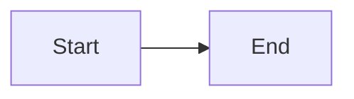

Docusaurus powers the documentation site you're reading right now. It's a powerful, React-based static site generator perfect for technical documentation. Here's why I chose it and how to get started.

{/* truncate */}

## Why Docusaurus?

- **React-based** - Full component flexibility
- **MDX support** - Markdown with JSX
- **Versioning** - Built-in docs versioning
- **i18n ready** - Translation support out of the box
- **Search** - Multiple search options
- **Theming** - Dark mode, customizable
- **Active development** - Facebook's open source team

## Quick Start

```bash
# Create new site
npx create-docusaurus@latest my-docs classic

# Start development server
cd my-docs
npm run start
```

Visit `http://localhost:3000` and you're live!

## Docs-Only Mode

For pure documentation (no blog, no landing page):

```javascript title="docusaurus.config.js"
const config = {
  // ...
  presets: [
    [
      'classic',
      {
        docs: {
          routeBasePath: '/', // Docs at root
          sidebarPath: './sidebars.js',
        },
        blog: false, // Disable blog
      },
    ],
  ],
};
```

## Writing Documentation

### Basic Markdown

```markdown title="docs/getting-started.md"
---
sidebar_position: 1
title: Getting Started
description: Quick start guide
tags: [intro, setup]
---

# Getting Started

Welcome to the documentation!

## Installation

Install with npm:

npm install my-package
```

### MDX Features

Include React components in your docs:

```jsx title="docs/interactive-demo.mdx"
---
title: Interactive Demo
---

import Tabs from '@theme/Tabs';
import TabItem from '@theme/TabItem';

<Tabs>
  <TabItem value="npm" label="npm" default>
    npm install package
  </TabItem>
  <TabItem value="yarn" label="Yarn">
    yarn add package
  </TabItem>
</Tabs>
```

### Admonitions

```markdown
:::tip[Pro Tip]
This is a useful tip!
:::

:::warning
Be careful with this!
:::

:::danger
This will break things!
:::
```

## Search Options

### Local Search

Free, no external service:

```bash
npm install @easyops-cn/docusaurus-search-local
```

```javascript title="docusaurus.config.js"
themes: [
  [
    require.resolve('@easyops-cn/docusaurus-search-local'),
    {
      hashed: true,
      language: ['en'],
    },
  ],
],
```

### Algolia DocSearch

Free for open source, powerful search:

1. Apply at [docsearch.algolia.com](https://docsearch.algolia.com)
2. Add credentials to config
3. Search just works

## Deployment Options

### Cloudflare Pages (Recommended)

```yaml title="Build settings"
Build command: npm run build
Build output directory: build
Root directory: /
```

Environment variables:
- `NODE_VERSION`: 18

### GitHub Pages

```bash
npm run deploy
```

Configure in `docusaurus.config.js`:
```javascript
organizationName: 'your-username',
projectName: 'your-repo',
deploymentBranch: 'gh-pages',
```

### Vercel / Netlify

Just connect your repo - they auto-detect Docusaurus.

## Custom Styling

```css title="src/css/custom.css"
:root {
  --ifm-color-primary: #2e8555;
  --ifm-code-font-size: 95%;
}

[data-theme='dark'] {
  --ifm-color-primary: #25c2a0;
}
```

## Advanced Features

### Mermaid Diagrams

```javascript title="docusaurus.config.js"
markdown: {
  mermaid: true,
},
themes: ['@docusaurus/theme-mermaid'],
```

Then in your docs:
````markdown

````

### Live Code Blocks

```bash
npm install @docusaurus/theme-live-codeblock
```

```jsx live
function Clock() {
  const [time, setTime] = useState(new Date());
  return <div>{time.toLocaleTimeString()}</div>;
}
```

### Changelog Feature

We've built a custom changelog component that shows update history:

```yaml
---
title: My Document
updates:
  - date: 2025-01-15
    note: "Added new section"
  - date: 2025-01-10
    note: "Initial documentation"
---
```

## Learn More

- [Docusaurus Installation](/Docusaurus/Docs/Installation)
- [Cloudflare Pages Deployment](/Docusaurus/Docs/Cloudflare%20Pages%20Deployment)
- [Styling Guide](/Docusaurus/Docs/Styling/Tabs)

---

*Building your own docs site? Share your experience on [Discord](https://discord.gg/6THYdvayjg)!*
