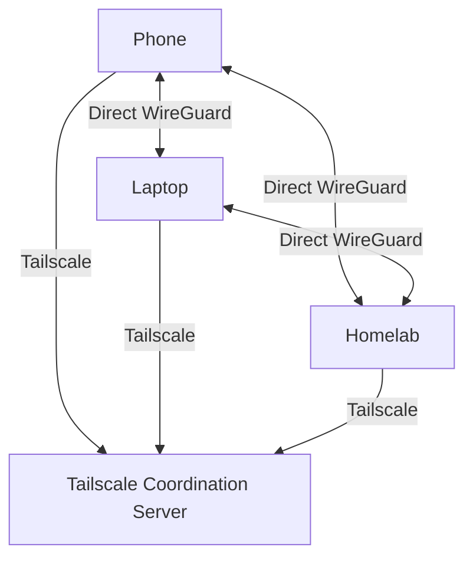

Want to access your homelab from anywhere without exposing ports to the internet? Tailscale creates a secure mesh VPN that "just works." Here's why it's become essential for homelabbers.

<!--truncate-->

## What is Tailscale?

Tailscale is a mesh VPN built on WireGuard that:

- **Requires zero configuration** - No port forwarding needed
- **Punches through NAT** - Works behind any router
- **Encrypts everything** - WireGuard-based security
- **Creates a mesh** - Devices connect directly
- **Free for personal use** - Up to 100 devices

## How It Works



1. Devices register with Tailscale's coordination server
2. Coordination server helps devices find each other
3. Actual traffic flows directly between devices (peer-to-peer)
4. All traffic is encrypted with WireGuard

## Installation

### On Ubuntu/Debian

```bash
# Add Tailscale repository
curl -fsSL https://tailscale.com/install.sh | sh

# Start Tailscale
sudo tailscale up

# Follow the authentication URL
```

### On Docker

```yaml title="docker-compose.yml"
services:
  tailscale:
    image: tailscale/tailscale:latest
    container_name: tailscale
    hostname: docker-host
    environment:
      - TS_AUTHKEY=tskey-auth-xxxxx  # From Tailscale admin console
      - TS_STATE_DIR=/var/lib/tailscale
      - TS_EXTRA_ARGS=--advertise-exit-node --advertise-routes=192.168.1.0/24
    volumes:
      - tailscale_data:/var/lib/tailscale
      - /dev/net/tun:/dev/net/tun
    cap_add:
      - NET_ADMIN
      - SYS_MODULE
    restart: unless-stopped

volumes:
  tailscale_data:
```

## Subnet Router (Access Entire Network)

The killer feature for homelabs: **subnet routing**. Access your entire LAN through Tailscale.

```bash
# On your homelab server
sudo tailscale up --advertise-routes=192.168.1.0/24 --accept-routes
```

Then in the Tailscale admin console:
1. Go to Machines
2. Find your server
3. Enable the route under "Subnets"

Now your phone can access `192.168.1.100:7878` (Radarr) from anywhere!

## Exit Node (Route All Traffic)

Use your homelab as a VPN exit point:

```bash
sudo tailscale up --advertise-exit-node
```

Enable in admin console, then on your mobile device:
1. Open Tailscale
2. Select your homelab as exit node
3. All traffic now routes through home

Great for:
- Accessing geo-restricted content
- Secure browsing on public WiFi
- Appearing to be "at home"

## MagicDNS

Tailscale provides automatic DNS for all your devices:

- `homelab.tail12345.ts.net`
- `laptop.tail12345.ts.net`
- `phone.tail12345.ts.net`

Enable in admin console under DNS settings.

## Funnel (Public Endpoints)

Need to expose a service publicly without port forwarding?

```bash
# Share a local service publicly
tailscale funnel 443 --bg
```

Your service becomes available at `https://machine-name.tail12345.ts.net`.

## ACLs (Access Control)

Control who can access what:

```json
{
  "acls": [
    // Family can access Jellyfin
    {"action": "accept", "users": ["family"], "ports": ["homelab:8096"]},
    // Only admin can access management interfaces
    {"action": "accept", "users": ["admin@example.com"], "ports": ["homelab:*"]},
  ]
}
```

## Tailscale vs Traditional VPN

| Feature | Tailscale | Traditional VPN |
|---------|-----------|-----------------|
| Port forwarding | Not needed | Required |
| Configuration | Minimal | Complex |
| NAT traversal | Automatic | Manual/Limited |
| Multi-site | Easy | Complex |
| Mesh networking | Built-in | Extra setup |
| Authentication | SSO/2FA | Certificates |

## My Tailscale Setup

Currently running:
- **Homelab server** - Subnet router + exit node
- **Work laptop** - Client
- **Phone** - Client with exit node for travel
- **Parents' house** - Subnet router (remote support!)

## Common Use Cases

1. **Access Plex/Jellyfin remotely** - No port forwarding
2. **SSH to home server** - Secure connection anywhere
3. **Access home network cameras** - Private surveillance
4. **Remote support** - Help family without TeamViewer
5. **Development** - Access home dev environment from anywhere

## Learn More

For the complete guide:

- [Tailscale Full Documentation](/Networking/Docs/Tailscale/Introduction)
- [Networking Fundamentals](/Networking/Introduction)

---

*Using Tailscale differently? Share your setup on [Discord](https://discord.gg/6THYdvayjg)!*
