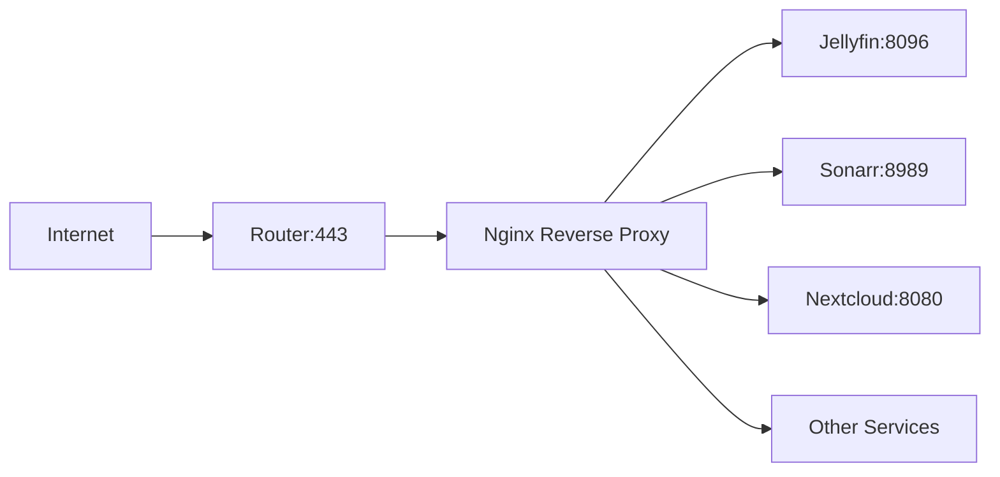

Running multiple services on your homelab? A reverse proxy is essential for clean URLs, SSL certificates, and proper security. Here's how to set up Nginx as your gateway to everything.

<!--truncate-->

## What Does a Reverse Proxy Do?

Instead of accessing services by port numbers:
- `http://192.168.1.100:8096` (Jellyfin)
- `http://192.168.1.100:8989` (Sonarr)
- `http://192.168.1.100:7878` (Radarr)

You get clean URLs with SSL:
- `https://jellyfin.home.yourdomain.com`
- `https://sonarr.home.yourdomain.com`
- `https://radarr.home.yourdomain.com`

### Benefits:
- **SSL everywhere** - Encrypt all traffic
- **Single entry point** - One port to expose (443)
- **Subdomain routing** - Clean URLs for each service
- **Load balancing** - Distribute traffic (for HA setups)
- **Caching** - Improve performance for static content

## Network Architecture



## Installing Nginx on Ubuntu

```bash
# Install Nginx
sudo apt update
sudo apt install -y nginx

# Enable and start
sudo systemctl enable nginx
sudo systemctl start nginx

# Verify
sudo nginx -t
```

## Basic Configuration Structure

Nginx configuration files:

<Trees title="/etc/nginx/">
  <File label="nginx.conf" badge="Main config" />
  <Folder label="sites-available" badge="Available site configs" expanded>
    <File label="default" />
    <File label="jellyfin.conf" />
  </Folder>
  <Folder label="sites-enabled" badge="Symlinks to active sites" expanded>
    <File label="jellyfin.conf" badge="→ ../sites-available/jellyfin.conf" />
  </Folder>
  <Folder label="conf.d" badge="Additional configs" />
  <Folder label="snippets" badge="Reusable config snippets" />
</Trees>

## SSL with Certbot (Let's Encrypt)

First, install Certbot:

```bash
sudo apt install -y certbot python3-certbot-nginx
```

Get certificates for your domains:

```bash
sudo certbot --nginx -d jellyfin.yourdomain.com
```

Certbot will:
1. Validate domain ownership
2. Generate certificates
3. Configure Nginx automatically
4. Set up auto-renewal

## Reverse Proxy Configuration

Here's a template for any service:

```nginx title="/etc/nginx/sites-available/service.conf"
server {
    listen 80;
    server_name service.yourdomain.com;
    return 301 https://$server_name$request_uri;
}

server {
    listen 443 ssl http2;
    server_name service.yourdomain.com;

    # SSL certificates (managed by Certbot)
    ssl_certificate /etc/letsencrypt/live/service.yourdomain.com/fullchain.pem;
    ssl_certificate_key /etc/letsencrypt/live/service.yourdomain.com/privkey.pem;

    # SSL settings
    ssl_protocols TLSv1.2 TLSv1.3;
    ssl_ciphers ECDHE-ECDSA-AES128-GCM-SHA256:ECDHE-RSA-AES128-GCM-SHA256;
    ssl_prefer_server_ciphers off;

    # Security headers
    add_header X-Frame-Options "SAMEORIGIN" always;
    add_header X-Content-Type-Options "nosniff" always;
    add_header X-XSS-Protection "1; mode=block" always;

    location / {
        proxy_pass http://127.0.0.1:8096;  # Internal service port
        proxy_http_version 1.1;
        proxy_set_header Host $host;
        proxy_set_header X-Real-IP $remote_addr;
        proxy_set_header X-Forwarded-For $proxy_add_x_forwarded_for;
        proxy_set_header X-Forwarded-Proto $scheme;
        proxy_set_header Upgrade $http_upgrade;
        proxy_set_header Connection "upgrade";
    }
}
```

Enable the site:

```bash
sudo ln -s /etc/nginx/sites-available/service.conf /etc/nginx/sites-enabled/
sudo nginx -t && sudo systemctl reload nginx
```

## Jellyfin Specific Configuration

Jellyfin needs WebSocket support for live transcoding:

```nginx title="/etc/nginx/sites-available/jellyfin.conf"
server {
    listen 443 ssl http2;
    server_name jellyfin.yourdomain.com;

    ssl_certificate /etc/letsencrypt/live/jellyfin.yourdomain.com/fullchain.pem;
    ssl_certificate_key /etc/letsencrypt/live/jellyfin.yourdomain.com/privkey.pem;

    # Large file uploads for libraries
    client_max_body_size 20M;

    location / {
        proxy_pass http://127.0.0.1:8096;
        proxy_set_header Host $host;
        proxy_set_header X-Real-IP $remote_addr;
        proxy_set_header X-Forwarded-For $proxy_add_x_forwarded_for;
        proxy_set_header X-Forwarded-Proto $scheme;

        # WebSocket support
        proxy_http_version 1.1;
        proxy_set_header Upgrade $http_upgrade;
        proxy_set_header Connection "upgrade";
    }

    location /socket {
        proxy_pass http://127.0.0.1:8096;
        proxy_http_version 1.1;
        proxy_set_header Upgrade $http_upgrade;
        proxy_set_header Connection "upgrade";
    }
}
```

## Cloudflare Integration

If using Cloudflare for DNS:

1. Set SSL mode to "Full (Strict)"
2. Add Cloudflare real IP restoration:

```nginx
# /etc/nginx/conf.d/cloudflare.conf
set_real_ip_from 103.21.244.0/22;
set_real_ip_from 103.22.200.0/22;
# ... add all Cloudflare IP ranges
real_ip_header CF-Connecting-IP;
```

## Troubleshooting

### 502 Bad Gateway
- Check if backend service is running
- Verify `proxy_pass` URL is correct
- Check firewall rules

### SSL Certificate Issues
```bash
sudo certbot renew --dry-run
```

### View Access Logs
```bash
sudo tail -f /var/log/nginx/access.log
```

## Learn More

- [Complete Nginx Documentation](/Reverse%20Proxy/Docs/Nginx/Installing%20Nginx)
- [Certbot with Cloudflare](/Reverse%20Proxy/Docs/Certbot/Cloudflare/)
- [Example Nginx Configs](/Examples/Reverse%20Proxies/Introduction)

---

*Running a different reverse proxy? Share your setup on [Discord](https://discord.gg/6THYdvayjg)!*
