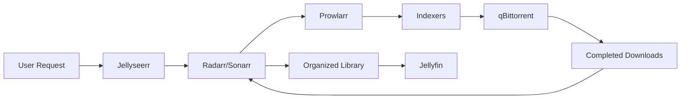

The Arr suite has revolutionized home media management. Radarr, Sonarr, Lidarr, and friends work together to automatically find, download, and organize your media. Here's how to set up the complete stack.

<!--truncate-->

## What's in the Arr Suite?

The "Arr" applications handle different media types:

| Application | Purpose |
|-------------|---------|
| **Radarr** | Movies |
| **Sonarr** | TV Shows |
| **Lidarr** | Music |
| **Readarr** | Books/Audiobooks |
| **Prowlarr** | Indexer management |
| **Jellyseerr** | Request management |
| **qBittorrent** | Download client |
| **JFA-Go** | Jellyfin account management |

## The Media Flow

Here's how everything connects:



1. User requests media through Jellyseerr
2. Request goes to Radarr/Sonarr
3. Arr app queries indexers via Prowlarr
4. Best release is sent to qBittorrent
5. Completed download is imported and renamed
6. Jellyfin picks up the new media

## Docker Compose Setup

Here's a simplified version of our full stack:

```yaml title="docker-compose.yml"
services:
  radarr:
    image: lscr.io/linuxserver/radarr:latest
    container_name: radarr
    environment:
      - PUID=1000
      - PGID=1000
      - TZ=America/New_York
    volumes:
      - radarr_config:/config
      - /data:/data
    ports:
      - "7878:7878"
    restart: unless-stopped

  sonarr:
    image: lscr.io/linuxserver/sonarr:latest
    container_name: sonarr
    environment:
      - PUID=1000
      - PGID=1000
      - TZ=America/New_York
    volumes:
      - sonarr_config:/config
      - /data:/data
    ports:
      - "8989:8989"
    restart: unless-stopped

  prowlarr:
    image: lscr.io/linuxserver/prowlarr:latest
    container_name: prowlarr
    environment:
      - PUID=1000
      - PGID=1000
      - TZ=America/New_York
    volumes:
      - prowlarr_config:/config
    ports:
      - "9696:9696"
    restart: unless-stopped

  jellyseerr:
    image: fallenbagel/jellyseerr:latest
    container_name: jellyseerr
    environment:
      - TZ=America/New_York
    volumes:
      - jellyseerr_config:/app/config
    ports:
      - "5055:5055"
    restart: unless-stopped

  qbittorrent:
    image: lscr.io/linuxserver/qbittorrent:latest
    container_name: qbittorrent
    environment:
      - PUID=1000
      - PGID=1000
      - TZ=America/New_York
      - WEBUI_PORT=8080
    volumes:
      - qbit_config:/config
      - /data/downloads:/data/downloads
    ports:
      - "8080:8080"
    restart: unless-stopped

volumes:
  radarr_config:
  sonarr_config:
  prowlarr_config:
  jellyseerr_config:
  qbit_config:
```

## Critical: Folder Structure

This is where most people go wrong. Use a unified structure:

<Trees title="/data">
  <Folder label="downloads" expanded>
    <Folder label="torrents" expanded>
      <Folder label="movies" />
      <Folder label="tv" />
    </Folder>
    <Folder label="usenet" expanded>
      <Folder label="movies" />
      <Folder label="tv" />
    </Folder>
  </Folder>
  <Folder label="media" expanded>
    <Folder label="movies" />
    <Folder label="tv" />
    <Folder label="music" />
  </Folder>
  <Folder label="recycle" badge="For deleted files" />
</Trees>

**Why this matters**: When Radarr/Sonarr imports a download, it can create a **hardlink** instead of copying. Same file, two paths, instant import with zero disk space used.

## VPN Integration

:::warning
Always use a VPN with torrenting applications! Check out our [VPN setup guide](/Examples/VPN/Introduction).
:::

Use the `binhex/qbittorrentvpn` image for built-in VPN:

```yaml
qbittorrent:
  image: binhex/arch-qbittorrentvpn
  environment:
    - VPN_ENABLED=yes
    - VPN_PROV=custom
    - VPN_CLIENT=openvpn
```

## Quality Profiles

Configure quality profiles in Radarr/Sonarr:

**Recommended for movies:**
- Minimum: 5GB
- Preferred: 10-15GB
- Maximum: 40GB
- Format: Bluray-2160p > Bluray-1080p > WEB-DL

**Recommended for TV:**
- Minimum: 1GB per episode
- Preferred: 2-4GB per episode
- Format: HDTV-2160p > Bluray-1080p > WEB-DL

## Recyclarr for Automation

Use Recyclarr to sync quality profiles from TRaSH Guides:

```bash
docker run --rm -v recyclarr_config:/config ghcr.io/recyclarr/recyclarr sync
```

This keeps your profiles up-to-date with community best practices.

## Flaresolverr for Cloudflare

Some indexers use Cloudflare protection. Add Flaresolverr:

```yaml
flaresolverr:
  image: ghcr.io/flaresolverr/flaresolverr:latest
  container_name: flaresolverr
  environment:
    - TZ=America/New_York
  ports:
    - "8191:8191"
  restart: unless-stopped
```

Configure in Prowlarr under Settings → Indexers → Add (FlareSolverr).

## Learn More

For the complete production-ready setup:

- [Full Stack Docker Compose](/Examples/Arr%20Suite/Docs/Full%20Stack/docker-compose)
- [Radarr Configuration](/Examples/Arr%20Suite/Docs/Radarr/docker-compose)
- [VPN Setup with qBittorrent](/Torrent%20Clients/Introduction)

---

*What does your Arr stack look like? Share your setup on [Discord](https://discord.gg/6THYdvayjg)!*
