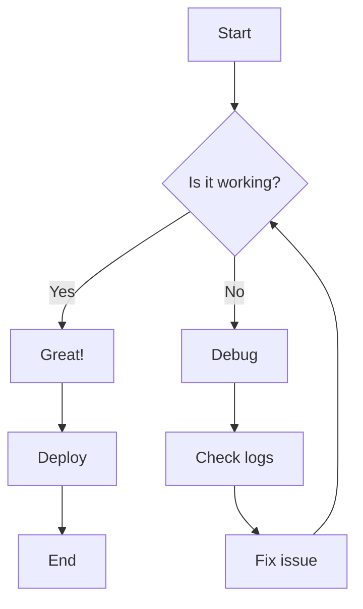
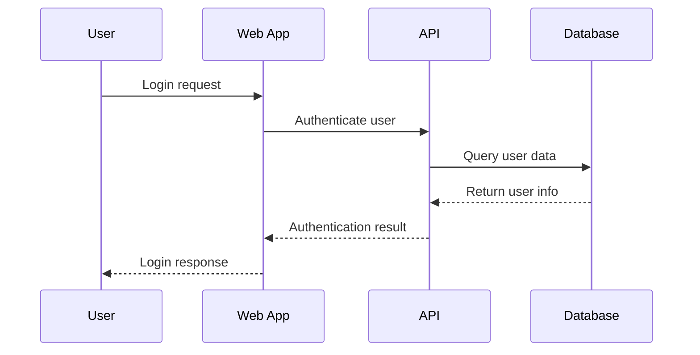
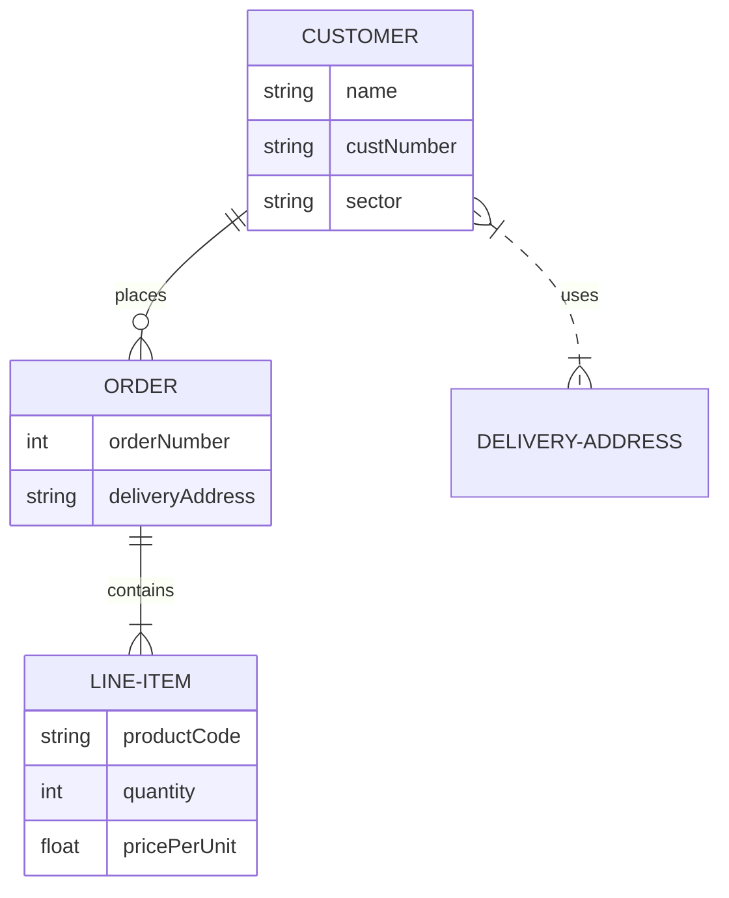
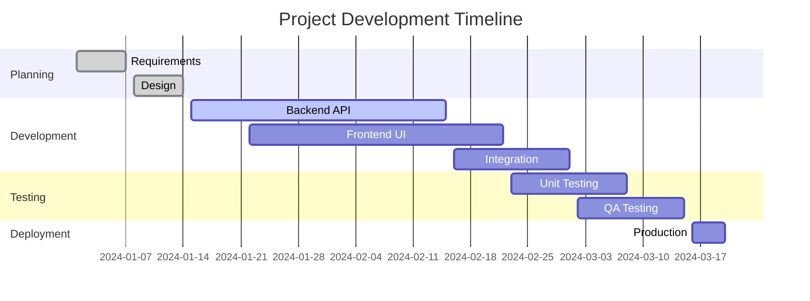
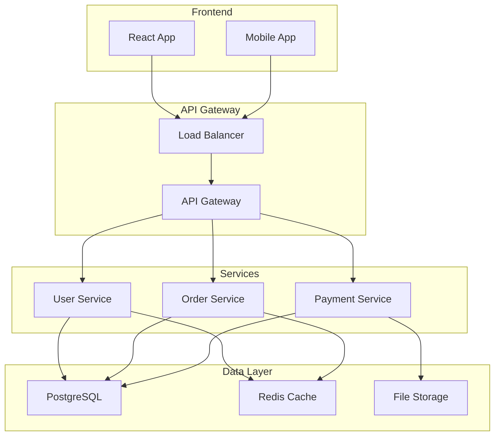
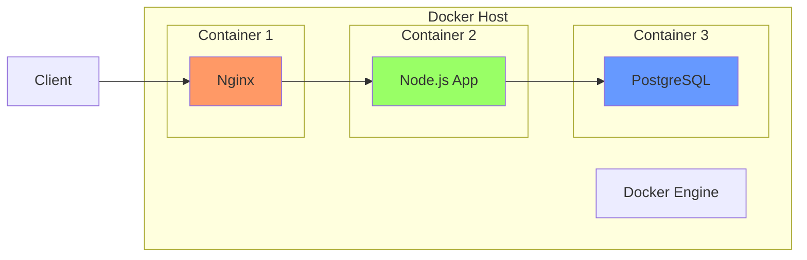
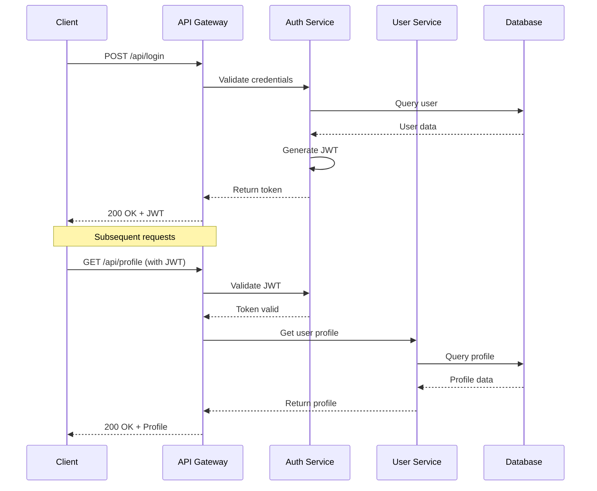
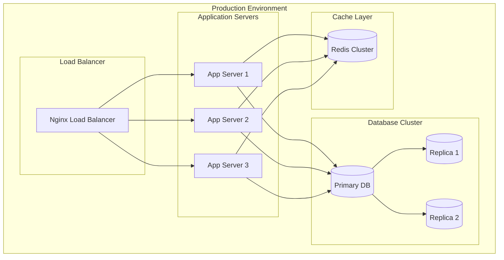
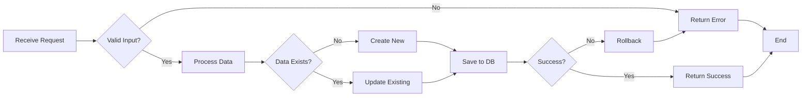

import BuyMeACoffeeButton from '@site/src/components/BuyMeACoffeeButton';
import Mermaid from '@theme/Mermaid';

# **Charts & Visual Elements in Docusaurus**

Visual elements like charts, diagrams, and flowcharts can significantly enhance your documentation by making complex information easier to understand. This guide covers various ways to add visual elements to your Docusaurus site.

## **Mermaid Diagrams**

Mermaid is the most popular choice for creating diagrams in Docusaurus. It supports various diagram types using simple text syntax.

### **Setup Mermaid**

First, install the Mermaid plugin:

```bash
npm install --save @docusaurus/theme-mermaid
```

Then configure it in your `docusaurus.config.ts`:

```typescript title="docusaurus.config.ts"
  // Adds Diagram support via Mermaid
  markdown: {
    mermaid: true,
  },
  themes: ['@docusaurus/theme-mermaid'],
```

### **Flowcharts**

Create flowcharts to show processes and decision trees:

````jsx

````

**Result:**


### **Sequence Diagrams**

Show interactions between different systems or components:

````jsx

````

**Result:**


### **Entity Relationship Diagrams**

Document database schemas and relationships:

````jsx

````

**Result:**


### **Gantt Charts**

Create project timelines and schedules:

````jsx

````

**Result:**


### **Git Flow Diagrams**

Visualize Git branching strategies:

````jsx
```mermaid
gitgraph
    commit id: "Initial"
    branch develop
    checkout develop
    commit id: "Feature prep"
    branch feature
    checkout feature
    commit id: "Feature work"
    commit id: "Feature complete"
    checkout develop
    merge feature
    commit id: "Integration"
    checkout main
    merge develop
    commit id: "Release 1.0"
```
````

**Result:**

```mermaid
gitgraph
    commit id: "Initial"
    branch develop
    checkout develop
    commit id: "Feature prep"
    branch feature
    checkout feature
    commit id: "Feature work"
    commit id: "Feature complete"
    checkout develop
    merge feature
    commit id: "Integration"
    checkout main
    merge develop
    commit id: "Release 1.0"
```

## **Network and Architecture Diagrams**

### **System Architecture**

Show how different components interact:

````jsx

````

**Result:**


### **Docker Architecture**

Visualize containerized applications:

````jsx

````

**Result:**


## **Custom Chart Components**

### **Simple Progress Bars**

Create custom progress indicators using CSS:

```jsx
<div style={{
  background: 'var(--ifm-color-emphasis-200)',
  borderRadius: '8px',
  padding: '4px',
  marginBottom: '1rem'
}}>
  <div style={{
    background: 'linear-gradient(90deg, #4CAF50 0%, #45a049 100%)',
    height: '24px',
    width: '75%',
    borderRadius: '4px',
    display: 'flex',
    alignItems: 'center',
    justifyContent: 'center',
    color: 'white',
    fontWeight: 'bold'
  }}>
    75% Complete
  </div>
</div>
```

**Result:**

<div style={{
  background: 'var(--ifm-color-emphasis-200)',
  borderRadius: '8px',
  padding: '4px',
  marginBottom: '1rem'
}}>
  <div style={{
    background: 'linear-gradient(90deg, #4CAF50 0%, #45a049 100%)',
    height: '24px',
    width: '75%',
    borderRadius: '4px',
    display: 'flex',
    alignItems: 'center',
    justifyContent: 'center',
    color: 'white',
    fontWeight: 'bold'
  }}>
    75% Complete
  </div>
</div>

### **Status Badges**

Create informative status indicators:

```jsx
<div style={{ display: 'flex', gap: '8px', flexWrap: 'wrap', marginBottom: '1rem' }}>
  <span style={{
    background: '#4CAF50',
    color: 'white',
    padding: '4px 12px',
    borderRadius: '16px',
    fontSize: '0.875rem',
    fontWeight: 'bold'
  }}>
    ✅ Operational
  </span>
  <span style={{
    background: '#FF9800',
    color: 'white',
    padding: '4px 12px',
    borderRadius: '16px',
    fontSize: '0.875rem',
    fontWeight: 'bold'
  }}>
    ⚠️ Maintenance
  </span>
  <span style={{
    background: '#f44336',
    color: 'white',
    padding: '4px 12px',
    borderRadius: '16px',
    fontSize: '0.875rem',
    fontWeight: 'bold'
  }}>
    🔴 Down
  </span>
</div>
```

**Result:**

<div style={{ display: 'flex', gap: '8px', flexWrap: 'wrap', marginBottom: '1rem' }}>
  <span style={{
    background: '#4CAF50',
    color: 'white',
    padding: '4px 12px',
    borderRadius: '16px',
    fontSize: '0.875rem',
    fontWeight: 'bold'
  }}>
    ✅ Operational
  </span>
  <span style={{
    background: '#FF9800',
    color: 'white',
    padding: '4px 12px',
    borderRadius: '16px',
    fontSize: '0.875rem',
    fontWeight: 'bold'
  }}>
    ⚠️ Maintenance
  </span>
  <span style={{
    background: '#f44336',
    color: 'white',
    padding: '4px 12px',
    borderRadius: '16px',
    fontSize: '0.875rem',
    fontWeight: 'bold'
  }}>
    🔴 Down
  </span>
</div>

## **ASCII Art and Text Diagrams**

### **Network Topology**

Use monospace fonts for ASCII diagrams:

```
                    ┌─────────────┐
                    │   Internet  │
                    └──────┬──────┘
                           │
                    ┌──────▼──────┐
                    │   Router    │
                    │ 192.168.1.1 │
                    └──────┬──────┘
                           │
              ┌────────────┼────────────┐
              │            │            │
       ┌──────▼──────┐ ┌───▼───┐ ┌──────▼──────┐
       │   Server    │ │  PC   │ │   Laptop    │
       │192.168.1.10 │ │ .1.20 │ │ 192.168.1.30│
       └─────────────┘ └───────┘ └─────────────┘
```

### **File Structure**

Show directory structures clearly:

```
project/
├── src/
│   ├── components/
│   │   ├── Header/
│   │   │   ├── Header.jsx
│   │   │   └── Header.css
│   │   └── Footer/
│   │       ├── Footer.jsx
│   │       └── Footer.css
│   ├── pages/
│   │   ├── Home.jsx
│   │   └── About.jsx
│   └── utils/
│       └── helpers.js
├── public/
│   ├── index.html
│   └── favicon.ico
├── package.json
└── README.md
```

## **Third-Party Chart Libraries**

### **Chart.js Integration**

For more complex charts, you can integrate Chart.js:

```bash
npm install chart.js react-chartjs-2
```

Create a custom component:

```jsx title="src/components/Chart/LineChart.jsx"
import React from 'react';
import {
  Chart as ChartJS,
  CategoryScale,
  LinearScale,
  PointElement,
  LineElement,
  Title,
  Tooltip,
  Legend,
} from 'chart.js';
import { Line } from 'react-chartjs-2';

ChartJS.register(
  CategoryScale,
  LinearScale,
  PointElement,
  LineElement,
  Title,
  Tooltip,
  Legend
);

export function LineChart({ data, options }) {
  return <Line data={data} options={options} />;
}
```

## **Best Practices**

### **Diagram Design**

- **Keep it simple**: Don't overcomplicate diagrams
- **Use consistent styling**: Maintain visual consistency across diagrams
- **Label clearly**: Ensure all elements are properly labeled
- **Consider color accessibility**: Use colorblind-friendly palettes

### **Performance Considerations**

- **Lazy loading**: Consider lazy loading for complex diagrams
- **Optimize images**: Compress any raster graphics
- **SVG when possible**: Use SVG for scalable graphics

### **Responsive Design**

```css
/* Make Mermaid diagrams responsive */
.mermaid svg {
  max-width: 100%;
  height: auto;
}

/* Responsive tables */
.table-responsive {
  overflow-x: auto;
}

/* Mobile-friendly charts */
@media (max-width: 768px) {
  .chart-container {
    overflow-x: auto;
  }
}
```

## **Common Use Cases**

### **API Flow Documentation**

````jsx

````

### **Infrastructure Documentation**

````jsx

````

### **Process Documentation**

````jsx

````

## **Resources**

- [Mermaid Official Documentation](https://mermaid-js.github.io/mermaid/)
- [Mermaid Live Editor](https://mermaid.live/) - Test and create diagrams online
- [Chart.js Documentation](https://www.chartjs.org/docs/latest/)
- [ASCII Art Generator](https://www.ascii-art-generator.org/) - Create ASCII art and diagrams
- [Lucidchart](https://www.lucidchart.com/) - Professional diagram creation tool
- [Draw.io](https://app.diagrams.net/) - Free online diagram editor

<BuyMeACoffeeButton />
