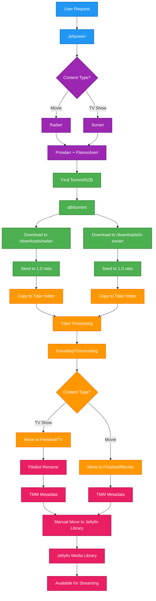

import BuyMeACoffeeButton from '@site/src/components/BuyMeACoffeeButton';

# Media Management Workflow

This document illustrates a comprehensive media management workflow using the *Arr suite of applications, along with additional tools for encoding, metadata management, and final library organization.

## Complete Workflow Diagram



## Workflow Components

### 1. Request Management
- **Jellyseerr**: Web interface for users to request Movies and TV shows
- Provides a clean, user-friendly interface for content requests
- Integrates with Radarr and Sonarr for automated processing

### 2. Content Management (*Arr Suite)
- **Radarr**: Handles movie requests and management
- **Sonarr**: Manages TV show requests and episode tracking
- **Prowlarr**: Unified indexer management with Flaresolverr for CloudFlare bypass
- **Flaresolverr**: Solves CloudFlare challenges for indexer access

### 3. Download Management
- **qBittorrent**: Primary torrent client for downloading content
- Downloads to organized folders:
  - `/downloads/radarr` for Movies
  - `/downloads/tv-sonarr` for TV shows
- Continues seeding to maintain 1.0 ratio while processing

### 4. Media Processing
- **Tdarr**: Automated media encoding and transcoding
- Monitors dedicated folders for new content
- Processes files while original continues seeding
- Moves completed files to organized directories:
  - `Finished/Movies` for processed Movies
  - `Finished/TV` for processed TV shows

### 5. File Organization & Metadata
- **FileBot**: Automated renaming for TV shows
- **TMM (TinyMediaManager)**: Metadata scraping and management
- Ensures proper naming conventions and rich metadata

### 6. Final Library Integration
- **Manual move**: Final step to move content to Jellyfin library folders
- **Jellyfin**: Media server for streaming organized content
- Content becomes available for streaming to users

## Key Benefits

1. **Automated Workflow**: Minimal manual intervention required
2. **Quality Control**: Tdarr ensures consistent encoding standards
3. **Organized Storage**: Proper folder structure and naming conventions
4. **Metadata Rich**: TMM provides comprehensive media information
5. **User-Friendly**: Jellyseerr provides easy request interface
6. **Efficient Seeding**: Maintains torrent ratios while processing

## Folder Structure

```
/downloads/
├── radarr/          # Movie downloads
└── tv-sonarr/       # TV show downloads

/tdarr/              # Tdarr processing folder

/Finished/
├── Movies/          # Processed Movies
└── TV/              # Processed TV shows

/jellyfin/           # Final library folders
├── Movies/
└── TV Shows/
```

## Additional Considerations

- **Storage Requirements**: Multiple copies exist during processing
- **Processing Time**: Encoding can be time-intensive
- **Network Usage**: Seeding requirements may impact bandwidth
- **Monitoring**: Regular checks ensure smooth operation
- **Backup Strategy**: Important to backup configurations and metadata

This workflow provides a robust, automated solution for media management while maintaining high quality standards and proper organization.

<BuyMeACoffeeButton />
