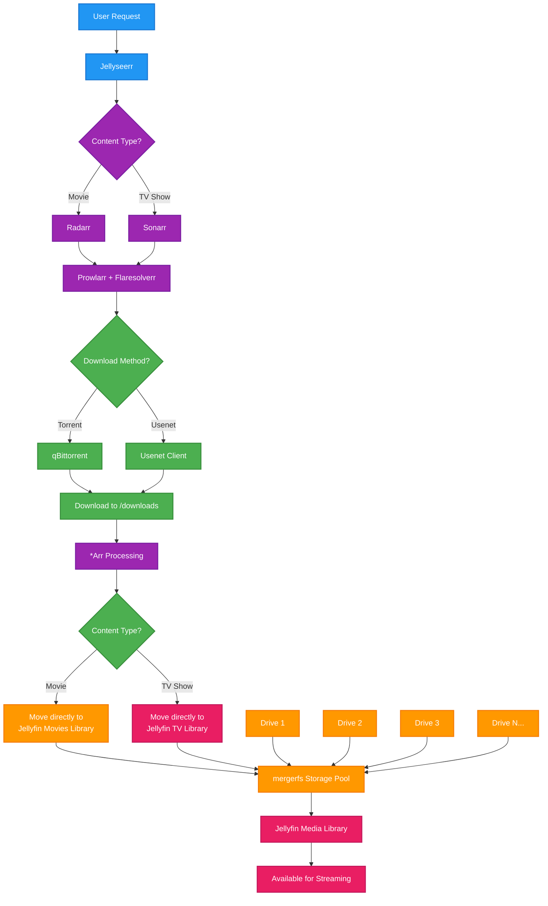

import BuyMeACoffeeButton from '@site/src/components/BuyMeACoffeeButton';

# Media Management Workflow

This document illustrates a streamlined media management workflow using the *Arr suite of applications with direct integration to Jellyfin libraries, utilizing mergerfs for storage pooling and supporting both torrent and Usenet downloads.

## Complete Workflow Diagram



## Workflow Components

### 1. Request Management
- **Jellyseerr**: Web interface for users to request Movies and TV shows
- Provides a clean, user-friendly interface for content requests
- Integrates with Radarr and Sonarr for automated processing

### 2. Content Management (*Arr Suite)
- **Radarr**: Handles movie requests and management
- **Sonarr**: Manages TV show requests and episode tracking
- **Prowlarr**: Unified indexer management with Flaresolverr for CloudFlare bypass
- **Flaresolverr**: Solves CloudFlare challenges for indexer access
- Configured to move completed downloads directly to Jellyfin libraries

### 3. Download Management
- **qBittorrent**: Primary torrent client for downloading content
- **Usenet Client**: Handles Usenet downloads (SABnzbd, NZBGet, etc.)
- Downloads to centralized `/downloads` folder
- Both torrent and Usenet sources managed through Prowlarr

### 4. Storage Management
- **mergerfs**: Union filesystem that pools multiple drives into a single mount point
- Provides unified storage view for Jellyfin libraries
- Allows mixing different drive sizes and types
- Enables easy expansion by adding new drives
- No RAID overhead - full capacity utilization

### 5. Media Library Integration
- **Direct Integration**: *Arr applications move content directly to Jellyfin libraries
- **Automatic Organization**: Files are properly named and organized automatically
- **Jellyfin**: Media server streams content from mergerfs-pooled storage
- **Immediate Availability**: Content becomes available for streaming as soon as download completes

## Key Benefits

1. **Streamlined Workflow**: Fully automated from request to availability
2. **Dual Download Sources**: Both torrent and Usenet support for maximum availability
3. **Direct Integration**: No intermediate processing steps - content goes straight to libraries
4. **Flexible Storage**: mergerfs allows easy expansion and mixed drive configurations
5. **User-Friendly**: Jellyseerr provides easy request interface
6. **High Availability**: Multiple indexers and download methods ensure content acquisition
7. **Storage Efficiency**: Full drive capacity utilization without RAID overhead
8. **Fault Tolerance**: Individual drive failures only affect content on that specific drive

## Folder Structure

```
/downloads/          # Temporary download location
├── complete/        # Completed downloads
└── incomplete/      # In-progress downloads

/media/merged/       # mergerfs mount point
├── movies/         # Jellyfin Movies library
├── tv/             # Jellyfin TV Shows library
├── music/          # Jellyfin Music library (if using Lidarr)
└── books/          # Jellyfin Books library (if using Readarr)

/mnt/               # Individual drive mount points
├── disk1/          # First storage drive
├── disk2/          # Second storage drive
├── disk3/          # Third storage drive
└── diskN/          # Additional drives as needed

# mergerfs pools all /mnt/disk* into /media/merged
```

## mergerfs Configuration

### Basic mergerfs Setup

```bash
# Install mergerfs
sudo apt install mergerfs

# Create mount points
sudo mkdir -p /mnt/disk{1,2,3}  # Adjust number based on your drives
sudo mkdir -p /media/merged

# Mount individual drives (add to /etc/fstab for persistence)
UUID=your-disk1-uuid /mnt/disk1 ext4 defaults,noatime 0 2
UUID=your-disk2-uuid /mnt/disk2 ext4 defaults,noatime 0 2
UUID=your-disk3-uuid /mnt/disk3 ext4 defaults,noatime 0 2

# Mount mergerfs pool (add to /etc/fstab for persistence)
/mnt/disk1:/mnt/disk2:/mnt/disk3 /media/merged mergerfs defaults,nonempty,allow_other,use_ino,cache.files=off,moveonenospc=true,dropcacheonclose=true,minfreespace=50G,fsname=mergerfs-pool,category.create=mfs 0 0
```

### Docker Integration

Ensure your *Arr containers mount the mergerfs pool with specific media type paths:

```yaml
# Example for Radarr
volumes:
  - /media/merged/movies:/movies  # mergerfs movies library
  - /downloads:/downloads         # temporary download location

# Example for Sonarr  
volumes:
  - /media/merged/tv:/tv          # mergerfs TV library
  - /downloads:/downloads         # temporary download location
```

## Additional Considerations

- **Storage Expansion**: Easy to add new drives to the mergerfs pool
- **Drive Failure**: Only content on failed drive is affected, rest remains accessible
- **Network Usage**: Usenet typically faster than torrents, reduces bandwidth impact
- **Monitoring**: Regular checks of drive health and mergerfs status
- **Backup Strategy**: Important to backup configurations and consider redundancy for critical content
- **Performance**: Direct file placement eliminates processing delays
- **Space Management**: mergerfs policies ensure optimal space utilization across drives

## Usenet Integration

### Recommended Usenet Clients

- **SABnzbd**: Popular, web-based Usenet client with excellent *Arr integration
- **NZBGet**: Lightweight, efficient Usenet downloader
- Both integrate seamlessly with Prowlarr for indexer management

### Usenet Benefits

- **Speed**: Typically faster than torrent downloads
- **Availability**: Better retention for older content
- **Privacy**: No uploading/seeding requirements
- **Reliability**: More consistent download speeds

This streamlined workflow provides a robust, automated solution for media management with minimal manual intervention and maximum storage flexibility.

<BuyMeACoffeeButton />
