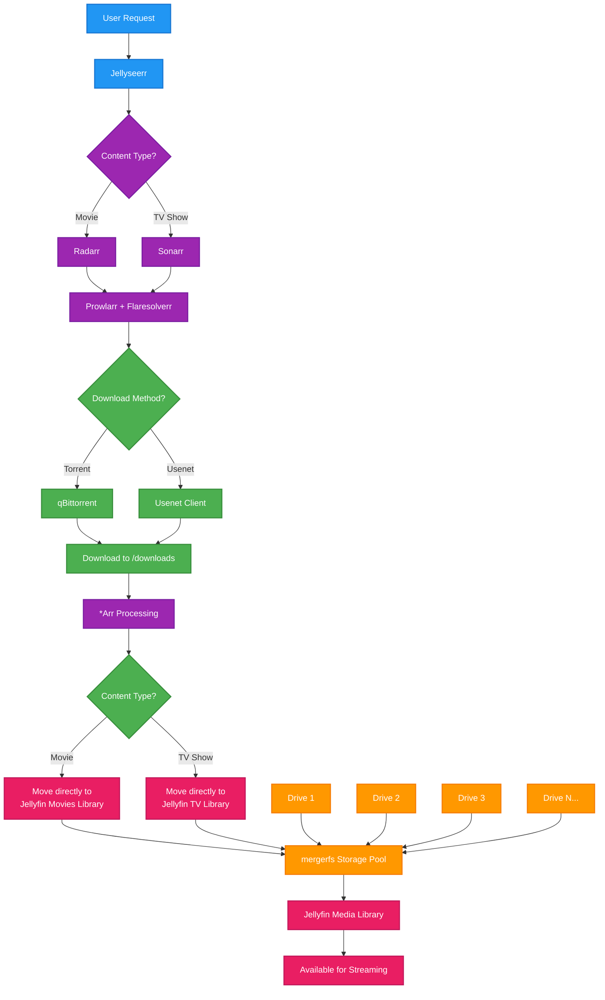

import BuyMeACoffeeButton from '@site/src/components/BuyMeACoffeeButton';

# Media Management Workflow

This document illustrates a streamlined media management workflow using the \*Arr suite of applications with direct integration to Jellyfin libraries, utilizing mergerfs for storage pooling and supporting both torrent and Usenet downloads.

## Complete Workflow Diagram


```mermaid
flowchart TD
    A[User Request] --> B[Jellyseerr]
    B --> C{Content Type?}

    C -->|Movie| D[Radarr]
    C -->|TV Show| E[Sonarr]

    D --> F[Prowlarr + Flaresolverr]
    E --> F

    F --> G{Download Method?}
    G -->|Torrent| H[qBittorrent]
    G -->|Usenet| I[Usenet Client]

    H --> J[Download to /downloads]
    I --> J

    J --> K[*Arr Processing]
    K --> L{Content Type?}

    L -->|Movie| M[Move directly to<br/>Jellyfin Movies Library]
    L -->|TV Show| N[Move directly to<br/>Jellyfin TV Library]

    M --> O[mergerfs Storage Pool]
    N --> O

    O --> P[Jellyfin Media Library]
    P --> Q[Available for Streaming]

    %% Storage representation
    R[Drive 1] --> O
    S[Drive 2] --> O
    T[Drive 3] --> O
    U[Drive N...] --> O

    %% Styling with better contrast
    classDef requestFlow fill:#2196F3,stroke:#1976D2,stroke-width:2px,color:#fff
    classDef arrSuite fill:#9C27B0,stroke:#7B1FA2,stroke-width:2px,color:#fff
    classDef downloadFlow fill:#4CAF50,stroke:#388E3C,stroke-width:2px,color:#fff
    classDef storageFlow fill:#FF9800,stroke:#F57C00,stroke-width:2px,color:#fff
    classDef finalFlow fill:#E91E63,stroke:#C2185B,stroke-width:2px,color:#fff

    class A,B requestFlow
    class C,D,E,F,K arrSuite
    class G,H,I,J,L downloadFlow
    class O,R,S,T,U storageFlow
    class M,N,P,Q finalFlow
```

## Workflow Components

### 1. Request Management

- **Jellyseerr**: Web interface for users to request Movies and TV shows
- Provides a clean, user-friendly interface for content requests
- Integrates with Radarr and Sonarr for automated processing

### 2. Content Management (\*Arr Suite)

- **Radarr**: Handles movie requests and management
- **Sonarr**: Manages TV show requests and episode tracking
- **Prowlarr**: Unified indexer management with Flaresolverr for CloudFlare bypass
- **Flaresolverr**: Solves CloudFlare challenges for indexer access
- Configured to move completed downloads directly to Jellyfin libraries

### 3. Download Management

- **qBittorrent**: Primary torrent client for downloading content
- **Usenet Client**: Handles Usenet downloads (SABnzbd, NZBGet, etc.)
- Downloads to centralized `/downloads` folder
- Both torrent and Usenet sources managed through Prowlarr

### 4. Storage Management

- **mergerfs**: Union filesystem that pools multiple drives into a single mount point
- Provides unified storage view for Jellyfin libraries
- Allows mixing different drive sizes and types
- Enables easy expansion by adding new drives
- No RAID overhead - full capacity utilization

### 5. Media Library Integration

- **Direct Integration**: \*Arr applications move content directly to Jellyfin libraries
- **Automatic Organization**: Files are properly named and organized automatically
- **Jellyfin**: Media server streams content from mergerfs-pooled storage
- **Immediate Availability**: Content becomes available for streaming as soon as download completes

## Key Benefits

1. **Streamlined Workflow**: Fully automated from request to availability
2. **Dual Download Sources**: Both torrent and Usenet support for maximum availability
3. **Direct Integration**: No intermediate processing steps - content goes straight to libraries
4. **Flexible Storage**: mergerfs allows easy expansion and mixed drive configurations
5. **User-Friendly**: Jellyseerr provides easy request interface
6. **High Availability**: Multiple indexers and download methods ensure content acquisition
7. **Storage Efficiency**: Full drive capacity utilization without RAID overhead
8. **Fault Tolerance**: Individual drive failures only affect content on that specific drive

## Folder Structure

:::warning[Bind Mount Consistency Required]
Use the same media path mapping in every related container (Sonarr, Radarr, qBittorrent, and others). The host bind-mount path and the in-container mount path must be consistent across services, or import/move operations can fail.
:::

<Trees title="/media/merged">
  <Folder label="movies" badge="Jellyfin Movies library" />
  <Folder label="tv" badge="Jellyfin TV Shows library" />
  <Folder label="music" badge="Jellyfin Music library (if using Lidarr)" />
  <Folder label="books" badge="Jellyfin Books library (if using Readarr)" />
  <Folder label="downloads" badge="Download location" expanded>
    <Folder label="Torrent" badge="qBittorrent download location" expanded>
      <Folder label="temp" badge="Temp download location" />
      <Folder label="radarr" />
      <Folder label="tv-sonarr" />
    </Folder>
    <Folder label="Usenet" badge="Usenet download location" expanded>
      <Folder label="temp" badge="Usenet temp download location" />
    </Folder>
  </Folder>
  <Folder label="cache" badge="Tdarr cache location (bind mount)" expanded>
    <Folder label="tdarr_cache" />
  </Folder>
</Trees>

<Trees title="/mnt">
  <Folder label="disk1" badge="First storage drive" />
  <Folder label="disk2" badge="Second storage drive" />
  <Folder label="disk3" badge="Third storage drive" />
  <Folder label="diskN" badge="Additional drives as needed" />
</Trees>

mergerfs pools all `/mnt/disk*` into `/media/merged`.

## mergerfs Configuration

### Basic mergerfs Setup

```bash
# Install mergerfs
sudo apt install mergerfs

# Create mount points
sudo mkdir -p /mnt/disk{1,2,3}  # Adjust number based on your drives
sudo mkdir -p /media/merged

# Mount individual drives (add to /etc/fstab for persistence)
UUID=your-disk1-uuid /mnt/disk1 ext4 defaults,noatime 0 2
UUID=your-disk2-uuid /mnt/disk2 ext4 defaults,noatime 0 2
UUID=your-disk3-uuid /mnt/disk3 ext4 defaults,noatime 0 2

# Mount mergerfs pool (add to /etc/fstab for persistence)
/mnt/disk1:/mnt/disk2:/mnt/disk3 /media/merged mergerfs defaults,nonempty,allow_other,use_ino,cache.files=partial,moveonenospc=true,dropcacheonclose=true,minfreespace=50G,fsname=mergerfs-pool,category.create=mfs,umask=002 0 0

# Use bind mounts for these directories so media doesnt get added on this drive
# Bind mount downloads from Processing drive
sudo mkdir -p /media/merged/downloads
sudo mount --bind /media/server/Processing/downloads /media/merged/downloads

# Keep Tdarr cache separate
sudo mkdir -p /media/merged/cache
sudo mount --bind /media/server/Processing/Tdarr /media/merged/cache
```

### Mount Option Reference

The fstab entry for mergerfs accepts a number of options that control how the filesystem behaves. Below is a breakdown of each option used in the example above:

| Option | Description |
|--------|-------------|
| `defaults` | Applies the standard mount defaults: `rw`, `suid`, `dev`, `exec`, `auto`, `nouser`, `async`. Safe baseline for most setups. |
| `nonempty` | Allows mounting over a directory that already contains files. Required when the mount point has subdirectories created beforehand (e.g. for bind mounts). |
| `allow_other` | Permits users other than the one who performed the mount (typically root) to access the filesystem. Required for Docker containers and non-root services to read/write files. |
| `use_ino` | Makes mergerfs use the underlying filesystem's inode numbers instead of generating its own. Improves compatibility with applications that rely on stable inodes (e.g. Plex, Jellyfin, and \*Arr apps). |
| `cache.files=partial` | Controls how file data is cached in the kernel page cache. See the [cache.files note](#cachefiles) below. |
| `moveonenospc=true` | If a write fails because a branch (disk) is full, mergerfs will automatically move the file to another branch with enough space and retry the write. Prevents "no space left on device" errors mid-write. |
| `dropcacheonclose=true` | Drops the kernel page cache for a file when it is closed. Helps prevent memory bloat on systems that stream large media files, since the cached data is unlikely to be re-read soon. |
| `minfreespace=50G` | mergerfs will not write new files to a branch that has less than 50 GB free. Prevents drives from being filled completely, which can cause filesystem errors. Adjust to suit your drive sizes. |
| `fsname=mergerfs-pool` | Sets a human-readable name for the filesystem as it appears in tools like `df`, `mount`, and `htop`. Purely cosmetic — change it to whatever makes sense for your setup. |
| `category.create=mfs` | Determines which branch new files are created on. `mfs` (Most Free Space) writes new files to whichever drive currently has the most available space, distributing data across drives over time. |
| `umask=002` | Sets the default permission mask for new files and directories created through the mergerfs mount. `002` means files are created as `664` (rw-rw-r--) and directories as `775` (rwxrwxr-x), giving group write access. See the [umask note](#umask002) below. |

---

#### cache.files {#cachefiles}

:::info[Not everyone needs `cache.files=partial`]
`cache.files` controls how aggressively the kernel caches file data from mergerfs:

- **`off`** — Disables the page cache entirely for mergerfs files. Every read goes directly to the underlying filesystem. This is the safest option and avoids stale-cache issues, but it means the kernel cannot use mmap-based I/O, which some applications require.
- **`partial`** — Enables the page cache for reads but not writes. This is compatible with applications that use `mmap()` (memory-mapped files), such as qBittorrent. Without this, torrent clients that use mmap for piece verification can fail with errors like **"no such device"** or silent I/O failures.
- **`full`** — Enables the page cache for both reads and writes. Improves performance but can cause stale data if files are modified outside of mergerfs (e.g. directly on a branch mount).
- **`auto-full`** — Automatically enables full caching only when a file is opened with `mmap`.

**Use `cache.files=partial` if** you run qBittorrent or any application that uses memory-mapped file I/O against the mergerfs mount. If you use only Usenet clients (SABnzbd, NZBGet) or never write downloads directly to the mergerfs pool, `cache.files=off` is the safer default.
:::

---

#### umask=002 {#umask002}

:::info[Not everyone needs `umask=002`]
By default, files created through mergerfs inherit the umask of the process that created them — typically `022`, which makes files `644` (owner read/write, everyone else read-only).

`umask=002` relaxes this to allow **group write access** (`664` for files, `775` for directories). This is useful when:

- Multiple services (e.g. Sonarr, Radarr, qBittorrent) run under different users but share the same group (commonly `media` with GID `1000` or similar).
- You want to avoid "permission denied" errors when one service tries to move or delete a file created by another.

**You do not need `umask=002` if** all your containers run as the same user, or if you manage permissions through Docker's `PUID`/`PGID` environment variables and they are all set to the same values. Adding it unnecessarily has no negative effect, but it does grant broader write access to any process in the group.
:::

---

### Docker Integration

Ensure your \*Arr containers mount the mergerfs pool with specific media type paths:

```yaml
# Example for Radarr
volumes:
  - /media/merged/movies:/movies  # mergerfs movies library

# Example for Sonarr
volumes:
  - /media/merged/tv:/tv          # mergerfs TV library
```

## Additional Considerations

- **Storage Expansion**: Easy to add new drives to the mergerfs pool
- **Drive Failure**: Only content on failed drive is affected, rest remains accessible
- **Network Usage**: Usenet typically faster than torrents, reduces bandwidth impact
- **Monitoring**: Regular checks of drive health and mergerfs status
- **Backup Strategy**: Important to backup configurations and consider redundancy for critical content
- **Performance**: Direct file placement eliminates processing delays
- **Space Management**: mergerfs policies ensure optimal space utilization across drives

## Usenet Integration

### Recommended Usenet Clients

- **SABnzbd**: Popular, web-based Usenet client with excellent \*Arr integration
- **NZBGet**: Lightweight, efficient Usenet downloader
- Both integrate seamlessly with Prowlarr for indexer management

### Usenet Benefits

- **Speed**: Typically faster than torrent downloads
- **Availability**: Better retention for older content
- **Privacy**: No uploading/seeding requirements
- **Reliability**: More consistent download speeds

This streamlined workflow provides a robust, automated solution for media management with minimal manual intervention and maximum storage flexibility.

<BuyMeACoffeeButton />
