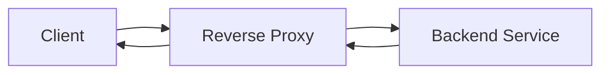
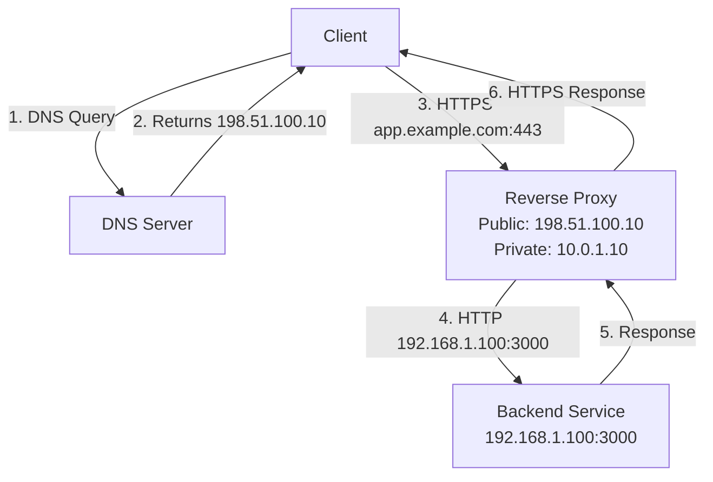
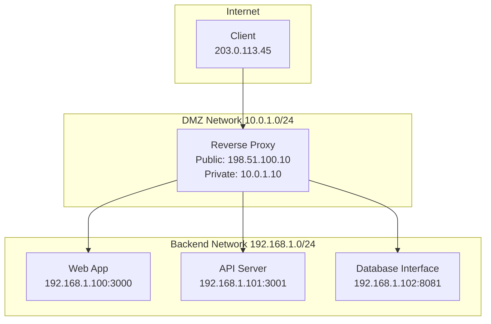

import BuyMeACoffeeButton from '@site/src/components/BuyMeACoffeeButton';

# **Introduction to Reverse Proxies**

In modern web architecture, reverse proxies are pivotal in enhancing application performance, security, and scalability. A reverse proxy is an intermediary server that sits between client devices and web servers, directing client requests to the appropriate backend server and returning the server's response to the client. This architecture improves efficiency, security, and manageability of web applications.

## ***Purpose of Reverse Proxies***

Reverse proxies are deployed for various reasons, with key purposes including:

- **Load Balancing:** Distributing traffic across multiple servers to ensure reliability and scalability.
- **Security:** Acting as an additional defense layer to obscure the identities of backend servers.
- **Caching:** Storing copies of static and dynamic content to speed up request processing and reduce backend load.
- **SSL Termination:** Managing SSL encryption/decryption, which offloads processing tasks from backend servers and centralizes certificate management.

## ***Network Flow Diagram***

The following diagram illustrates how a reverse proxy handles requests for a service with a domain:

**Flow:** Client ↔ [HTTPS] ↔ Reverse Proxy ↔ [HTTP] ↔ Backend Service

**Detailed Network Flow:**

**Network Architecture:**

**Domain to Service Mapping:**
- `app.example.com` → Web Application (192.168.1.100:3000)
- `api.example.com` → API Server (192.168.1.101:3001)  
- `db.example.com` → Database Interface (192.168.1.102:8081)

**Network Segmentation:**
- **Public Interface**: 198.51.100.10 (Internet-facing)
- **DMZ Network**: 10.0.1.0/24 (Reverse proxy location)
- **Backend Network**: 192.168.1.0/24 (Internal services)
- **Client IP**: 203.0.113.45 (Example client)

**Flow Explanation:**
1. **DNS Resolution**: The client performs a DNS query for `app.example.com` which resolves to the reverse proxy's public IP `198.51.100.10`
2. **Client Request**: The client (IP: `203.0.113.45`) sends an HTTPS request to `https://app.example.com:443`
3. **Reverse Proxy Reception**: The reverse proxy server (public IP: `198.51.100.10`) receives the request on port 443
4. **Backend Forwarding**: The proxy forwards the request internally to the appropriate backend service (e.g., `http://192.168.1.100:3000`)
5. **Response Delivery**: The backend service responds, and the reverse proxy sends the HTTPS response back to the client with SSL termination

**Key Network Benefits:**
- **Single Public IP**: Multiple services accessible through one public IP address (`198.51.100.10`)
- **Private Backend Network**: Backend services operate securely on private IPs (`192.168.1.x`)
- **Domain-Based Routing**: Different subdomains route to different backend services
- **SSL Termination**: HTTPS encryption/decryption handled at the proxy level
- **Load Balancing**: Traffic distributed across multiple backend instances

## ***Types of Reverse Proxies and Comparison***

### *Nginx*

Nginx, pronounced as "Engine-X," is renowned for its high performance, stability, and low resource consumption. Initially released in 2004, it quickly became the go-to solution for serving static content and as a reverse proxy for HTTP and HTTPS traffic. Its event-driven architecture allows handling of thousands of concurrent connections within a minimal hardware footprint.

**Benefits:**
- High efficiency with static and dynamic content.
- Scalable handling of concurrent connections.
- SSL/TLS termination and HTTP/2 support.
- Extensive community support and rich documentation.

### *Caddy*

Caddy is a relatively newer web server that automatically provides HTTPS by default. It stands out for its simplicity and ease of use, catering especially well to modern web applications and development environments. Caddy's automatic HTTPS setup, including obtaining and renewing certificates, significantly simplifies secure web publishing.

**Benefits:**
- Simplified configuration with an expressive configuration file.
- Automatic HTTPS by default, with automatic certificate renewal.
- Extensible through plugins.
- Great for rapid development deployments and prototyping.

### *Apache HTTP Server*

Apache has long been a reliable and versatile web server that can also act as a reverse proxy through modules like `mod_proxy`. It provides a breadth of features and wide compatibility with various operating systems and programming languages.

**Benefits:**
- Extensive module system for flexibility and customizability.
- Wide adoption and strong community support.
- Strong compatibility with numerous applications.

### *HAProxy*

HAProxy specializes in high availability, load balancing, and proxying for TCP and HTTP applications. It’s known for its reliability, offering fine-grained load-balancing capabilities and detailed stats.

**Benefits:**
- High performance and reliability in load balancing.
- Advanced monitoring and logging capabilities.
- Capable of handling a very high number of concurrent connections.

### *Traefik*

Traefik is a cloud-native reverse proxy and load balancer designed specifically for containerized and microservices architectures. It dynamically routes requests to backend services and effortlessly integrates with platforms like Kubernetes, Docker, and others.

**Key Features:**
- Automatic service discovery and configuration in dynamic environments.
- Native support for a variety of container and orchestration technologies.
- Middleware functionality for enhancing request processing.
- Built-in dashboard and monitoring capabilities.

## ***Comparison and Use Cases***

When choosing a reverse proxy, the specific needs of the deployment environment, including performance requirements, ease of configuration, and integration capabilities, play a crucial role.

- **Nginx** is best suited for environments that require high performance and efficient handling of static content. Its extensive configuration options make it highly flexible for complex scenarios.
- **Caddy** shines in scenarios where ease of use and automatic HTTPS are prioritized, making it ideal for small to medium-sized deployments and developers looking for a hassle-free setup.
- **Traefik** stands out in dynamic, microservices-based environments, offering seamless integration with container orchestration tools. Its automatic reconfiguration capabilities simplify the deployment workflow in constantly evolving application landscapes.

## ***Conclusion***

The choice of a reverse proxy server is contingent upon specific requirements such as performance needs, ease of configuration, security features, and support for modern web technologies. Nginx provides a robust, high-performance solution for dynamic web applications, while Caddy offers an innovative and developer-friendly approach with its automatic HTTPS and minimal configuration. Apache remains a strong contender for comprehensive feature sets, and HAProxy excels in high-availability environments.

Incorporating a reverse proxy into your web architecture can substantially enhance security, performance, and manageability, paving the way for scalable and efficient web applications.

<BuyMeACoffeeButton />
